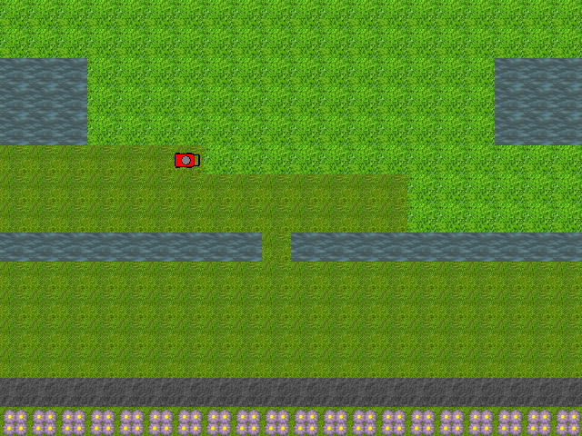

# About "Kosiarka" ✨

My old game about mowing the grass written with C++ and SDL library. The aim of the game is to mow the grass using as little fuel as possible. To make things more difficult, there are obstacles placed on the map, after driving over which the mower's blade becomes dull. For each level (except the last one), the player receives a certain amount of fuel to use, if he does not use all of it, the rest of the fuel is transferred to the next level, so that when the designated fuel runs out for a given level, you will be able to use this reserve. The game requires you to think ahead because of the final level the player is on his own - he doesn't get a single drop of fuel at the start, he has to complete the level with the fuel he has collected so far.

# Game features 🕹️

- mower control,
- stone collision detection,
- screen edges collision detection,
- loading a map from a file,
- the mower leaves "cut grass" behind,
- animation when running over a stone,
- obstacles like asphalt and water
- flowers are used to decorate the level,
- results are displayed after completing (or not completing) each level,
- the game have 15 levels.

# Funfacts 🍬

1) I came up with the idea to write a game when I was working abroad in England during the holidays. I worked with a nice gentleman who mowed lawns.

2) The game took part in a competition organized by the Polish gamedev community - **warsztat.gd**. I don't remember what place I took in it, but I remember that the community accepted this idea very well and suggested ideas for the development of the game. [Link to archive](https://web.archive.org/web/20121021061224/http://warsztat.gd/projects/kosiarka/info)

> [!NOTE]
> Game works only on Microsoft Windows systems.